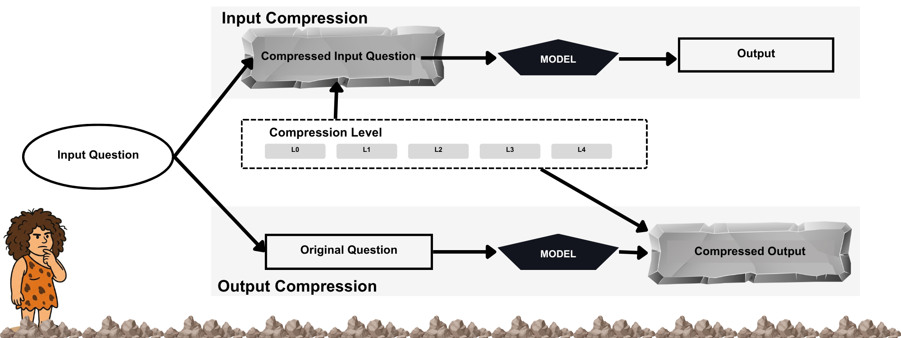

# CAVEWOMAN: How Large Language Models Behave Under Linguistic Input and Output Compression



*Paper: [arXiv:2606.24083](https://arxiv.org/abs/2606.24083).*

**Dataset:** model generations are released on Hugging Face at [rayascript/cavewoman-data](https://huggingface.co/datasets/rayascript/cavewoman-data).

CAVEWOMAN is a two-channel benchmark that measures what happens to model
accuracy when you strip language down to caveman register, either by
**compressing the prompt** (Condition A) or by **constraining the
response** (Condition B), across five reduction levels (L0..L4).

## Scale

| | |
|---|---:|
| Cells (model x dataset x channel x level) | **450** |
| Model generations | **1,031,850** |
| API calls | **458,713** |
| Local-GPU time | **425 GPU-hours** |
| Models run | **9** (4 open-weight + 5 commercial API) |
| Datasets | 5 |
| Semantic-fidelity metrics | 14+ |

## Quickstart

```bash
# 1. Install dependencies
pip install -r requirements.txt
python -m spacy download en_core_web_sm

# 2. Configure API keys (only needed for API model runs)
cp .env.example .env   # then fill in OPENAI_API_KEY / ANTHROPIC_API_KEY

# 3. Run one cell, e.g. gpt-4o on GSM8K, output-constrained, L0
python experiments/run_experiment_api.py \
    --model gpt-4o \
    --dataset gsm8k \
    --condition output \
    --level L0 \
    --output_dir ./results/gpt4o_output/gsm8k

# 4. Score it
python evaluation/evaluate_results.py --results_dir ./results/gpt4o_output/gsm8k
```

## What's in here

- **[src/](src/)**: shared modules (constraint prompts, dataset loaders, model loader, metrics, NLI scorer).
- **[experiments/](experiments/)**: `run_experiment.py` (local HF models) and `run_experiment_api.py` (OpenAI / Anthropic / Azure).
- **[evaluation/](evaluation/)**: accuracy scoring plus embedding and NLI semantic-fidelity scorers.
- **[analysis/](analysis/)**: the numbered analysis pipeline that turns scored JSONLs into every paper table and figure.
- **[jobs/](jobs/)**: shell scripts that orchestrated the paper runs (SLURM submissions and per-model tmux runners).
- **[benchmark/](benchmark/)**: channel definitions, level configs, and structured metadata.
- **[prompts/](prompts/)**: the canonical L0-L4 system prompts.
- **[results/](results/)**: headline paper tables (CSV) and one sample per-record JSONL per (model x condition).
- **[docs/](docs/)**: sources for the project website.
- **[scripts/](scripts/)**: small utilities (`pos_filter_demo.py`, `smoke_test_slurm.sh`).

## Cite

```bibtex
@misc{adeyemi2026cavewoman,
  title         = {CAVEWOMAN: How Large Language Models Behave Under
                   Linguistic Input and Output Compression},
  author        = {Adeyemi, Morayo Danielle and Rossi, Ryan A. and Dernoncourt, Franck},
  year          = {2026},
  eprint        = {2606.24083},
  archivePrefix = {arXiv},
  primaryClass  = {cs.CL},
  url           = {https://arxiv.org/abs/2606.24083}
}
```

## Contact

Morayo Adeyemi, morayo.danielle@gmail.com
